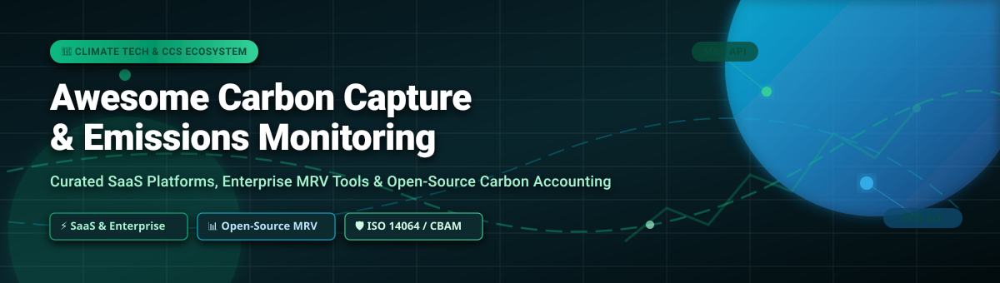

<div align="center">



# 🌍 Awesome Carbon Capture & Emissions Monitoring 📊

<a href="https://github.com/ishandutta2007/Awesome-Awesome-Awesome"></a><a href="https://discord.gg/jc4xtF58Ve"></a>
<a href="https://github.com/ishandutta2007/Awesome-Awesome-Awesome"></a>
[](https://opensource.org/licenses/MIT)
[](https://github.com/ishandutta2007/Awesome-Carbon-Capture-Monitoring/pulls)
[](#)
<a href="https://github.com/ishandutta2007"></a>

**A Curated Ecosystem of Enterprise SaaS Platforms & Open-Source Projects for Carbon Accounting, GHG Emissions Tracking, & CCS Monitoring, Reporting & Verification (MRV)**

---

</div>

## 📌 Executive Overview & SEO Meta Summary

This repository tracks leading **SaaS enterprise solutions** and **active open-source projects** dedicated to **Carbon Capture Monitoring**, **Greenhouse Gas (GHG) Accounting**, **Scope 1, 2, & 3 Emissions Tracking**, and **Measurement, Reporting & Verification (MRV)** for Carbon Capture and Storage (CCS) infrastructure. 

Whether you are a sustainability manager navigating **EU CBAM** and **CSRD compliance**, a software engineer building vendor-independent carbon calculation engines, or a geoscientist assessing containment risks in geological storage reservoirs, this guide provides audit-ready tools aligned with the **GHG Protocol** and **ISO 14064-1** standards.

---

## 📑 Table of Contents

- [🏢 SaaS & Enterprise Hosted Platforms](#-saas--enterprise-hosted-platforms)
- [💻 Open-Source GitHub & GitLab Projects](#-open-source-github--gitlab-projects)
- [📜 Regulatory Standards & Framework Alignment](#-regulatory-standards--framework-alignment)
- [🛠️ Developer Quickstart & Integration Stacks](#%EF%B8%8F-developer-quickstart--integration-stacks)
- [💖 Support & Sponsorship](#-support--sponsorship)
- [📈 Star History](#-star-history)
- [🤝 How to Contribute](#-how-to-contribute)
- [⚠️ Disclaimer](#%EF%B8%8F-disclaimer)

---

## 🏢 SaaS & Enterprise Hosted Platforms

> 📈 **Market Insights & Industry Structure**: The global carbon accounting and climate management software market size is estimated at **$15.4 Billion by 2030** (growing at a CAGR of ~22.8% from $3.1 Billion in 2024). The sector is currently **moderately fragmented**—transitioning from early-stage point solutions toward enterprise consolidation driven by mandatory climate disclosures (such as EU CSRD, CBAM, SEC climate rules, and EPA Subpart RR). Category leaders like IBM Envizi, Watershed, and Persefoni are positioning themselves as core enterprise compliance platforms.

Below is a curated list of top enterprise SaaS platforms, **sorted by Company Size / Valuation (descending)**:

| 🏢 Platform & Link | 📝 Core Capabilities | 💵 Specific Starting Price | 🎁 Free Tier / Free Trial Limits | 📊 Company Size / Valuation |
| :--- | :--- | :--- | :--- | :--- |
| **[IBM Envizi](https://www.ibm.com/products/envizi)** | 🏢 Enterprise ESG reporting suite, automated emissions data capture, and Scope 1-3 audit trail management. | **$1,000 / month** ($12,000/yr starting base software package on IBM / AWS Marketplace) | **14-day interactive sandbox demo** (1 user seat, pre-loaded sample datasets, no full data export) | 👑 **$61.8 Billion** *(Parent IBM Annual Revenue; Envizi acquired for ~$100M+)* |
| **[Watershed](https://watershed.com/)** | ⚡ Enterprise climate platform with granular supply-chain decarbonization, CEDA emissions factor DB, and audit-ready disclosure reports. | **$4,167 / month** ($50,000/yr base tier subscription for mid-market enterprises) | **No free trial** (0-day trial; sales demo only; provides free access to public *Open CEDA* factor DB) | 🦄 **$1.8 Billion** *(Series C Valuation; $100M+ raised from Sequoia & Kleiner Perkins)* |
| **[Persefoni](https://persefoni.com/)** | 🛡️ Climate management and accounting platform (CMAP) specializing in financial institution emissions (PCAF) & SEC/CSRD compliance. | **$833 / month** ($10,000/yr starting cost for Persefoni Advanced Tier) | **Free Forever Plan** (*Persefoni Pro*: Scope 1-3 footprint calculator, 1 user seat, up to 1,000 transactions/yr) | 🚀 **$300 Million** *(Series C Valuation; $114M total capital raised)* |
| **[Sweep](https://www.sweep.net/)** | 🌐 Enterprise ESG data mesh platform for managing large-scale supply chain carbon data, reduction roadmaps, and CSRD compliance. | **$916 / month** (€10,000/yr ~$11,000/yr starting contract for enterprise deployment) | **14-day guided proof-of-concept trial** (sales-assisted setup limited to 5 activity dataset uploads) | 💎 **$200 Million** *(Estimated Valuation; $100M raised from Coatue & Balderton)* |
| **[Greenly](https://greenly.earth/)** | 🌿 SME & mid-market carbon accounting with automated bank integration, AI emissions parsing, and CSRD compliance checkers. | **$162 / month** ($1,950/yr starting tier base subscription for small-to-medium businesses) | **14-day free trial** (unlimited access to AI Carbon Calculator, ROI estimator, & CSRD checker tools) | 📈 **$150 Million** *(Valuation; $135M funding; merged with Normative reaching $34.8M ARR)* |
| **[Plan A](https://plana.earth/)** | 🎯 Automated carbon accounting and ESG reporting software for corporate decarbonization roadmaps and regulatory compliance. | **$137 / month** (€1,500/yr starting price package for basic corporate footprinting) | **7-day free trial** (self-service sandbox limited to 100 activity entries & basic PDF export) | 🚀 **$100 Million** *(Valuation; $40M funding raised led by Lightspeed Venture Partners)* |
| **[SINAI Technologies](https://www.sinaitechnologies.com/)** | 🏭 Decarbonization intelligence platform for carbon-intensive industries (metals, mining, utilities) with marginal abatement cost curves. | **$833 / month** ($10,000/yr starting price for single-facility decarbonization module) | **14-day interactive demo access** (sales-qualified demo limited to 1 facility simulation model) | 🏢 **$100 Million** *(Series B Valuation; $39M total capital raised from climate VCs)* |
| **[CarbonChain](https://www.carbonchain.com/)** | ⛓️ Automated supply chain carbon accounting for carbon-intensive commodities (metals, energy, agriculture) with CBAM validation. | **$1,250 / month** ($15,000/yr starting plan for commodity trade carbon tracking) | **14-day trial upon request** (guided demo access limited to 3 commodity shipment batches) | 📦 **$80 Million** *(Series A Valuation; $10M raised led by Union Square Ventures)* |
| **[Normative](https://normative.io/)** | 📐 Science-based carbon accounting engine for measuring Scope 1, 2, & 3 corporate emissions with audit-proof transaction analysis. | **$325 / month** (€3,600/yr starting plan for growing businesses) | **Free Forever Plan** (*Business Carbon Calculator*: companies <50 employees, up to 500 invoices/yr) | 📊 **$70 Million** *(Valuation; $40M capital raised; merged software operations with Greenly)* |
| **[Emitwise](https://www.emitwise.com/)** | 🛰️ Supply chain carbon management platform leveraging machine learning to automate Scope 3 supplier data collection. | **$1,000 / month** ($12,000/yr starting plan for enterprise supply chain monitoring) | **14-day trial after demo** (sales-consultation required; limited to 20 supplier survey dispatches) | 🤝 **$60 Million** *(Valuation; $17M capital raised; acquired by Green Project Tech)* |

---

## 💻 Open-Source GitHub & GitLab Projects

> 🌟 Open-source software provides transparent calculation methodologies, offline desktop utilities, exascale geological simulators, and satellite GHG plume detection tools. Below is a complete list **sorted by GitHub Star Count (descending)**.

| 📦 Repository & Link | ⭐ Star Count & Badge | 🏷️ Category & License | 📖 Description & Capabilities |
| :--- | :--- | :--- | :--- |
| **[Cloud Carbon Footprint](https://github.com/cloud-carbon-footprint/cloud-carbon-footprint)** | [](https://github.com/cloud-carbon-footprint/cloud-carbon-footprint/stargazers) | ☁️ Cloud IT / MIT | Multi-cloud energy usage (kWh) and GHG emissions (metric tons CO2e) measurement across AWS, GCP, and Azure. |
| **[co2.js](https://github.com/thegreenwebfoundation/co2.js)** | [](https://github.com/thegreenwebfoundation/co2.js/stargazers) | ⚡ Web & Node.js / Apache-2.0 | Green Web Foundation JavaScript npm package to calculate carbon emissions from digital services and byte transfers. |
| **[GEOS](https://github.com/GEOS-DEV/GEOS)** | [](https://github.com/GEOS-DEV/GEOS/stargazers) | 🌋 CCS Reservoir / LGPL-2.1 | Exascale-ready C++ multiphysics simulator for geological carbon storage (GCS), reservoir geomechanics, and plume surveillance. Developed with TotalEnergies. |
| **[Green Metrics Tool](https://github.com/green-coding-solutions/green-metrics-tool)** | [](https://github.com/green-coding-solutions/green-metrics-tool/stargazers) | 🖥️ Software Dev / GPL-3.0 | Containerized infrastructure measuring CPU/RAM energy usage and software carbon footprints during CI/CD pipelines. |
| **[Hyperledger Carbon Accounting](https://github.com/hyperledger-labs/blockchain-carbon-accounting)** | [](https://github.com/hyperledger-labs/blockchain-carbon-accounting/stargazers) | 🔗 Blockchain MRV / Apache-2.0 | Linux Foundation project implementing smart contracts for emissions tokenization, carbon offsets, and verifiable audit trails. |
| **[Carbonalyser](https://github.com/carbonalyser/Carbonalyser)** | [](https://github.com/carbonalyser/Carbonalyser/stargazers) | 🌐 Web Browser / GPL-3.0 | Web browser extension visualizing electrical energy consumption and GHG emissions caused by internet browsing. |
| **[Tracarbon](https://github.com/fvaleye/tracarbon)** | [](https://github.com/fvaleye/tracarbon/stargazers) | 💻 Device Monitoring / Apache-2.0 | CLI & Python library tracking device power consumption and calculating carbon intensity based on location. |
| **[Carbonifer](https://github.com/carboniferio/carbonifer)** | [](https://github.com/carboniferio/carbonifer/stargazers) | 🏗️ Infrastructure-as-Code / MIT | CLI tool inspecting Terraform IaC scripts to forecast cloud infrastructure carbon emissions prior to cloud deployment. |
| **[WRI Carbon Budget Model](https://github.com/wri/carbon-budget)** | [](https://github.com/wri/carbon-budget/stargazers) | 🌲 Forestry / MIT | World Resources Institute tool calculating gross GHG emissions, forest carbon sequestration, and net land flux. |
| **[CCS Reservoir Simulation Suite](https://github.com/yohanesnuwara/carbon-capture-and-storage)** | [](https://github.com/yohanesnuwara/carbon-capture-and-storage/stargazers) | 🛢️ CCS Geomechanics / MIT | Integrated reservoir simulation, rock physics, seismic modeling, & geomechanics suite for CCS site monitoring. |
| **[OpenAir Cyan](https://github.com/openair-collective/openair-cyan)** | [](https://github.com/openair-collective/openair-cyan/stargazers) | 💨 Direct Air Capture / CC-BY-SA-4.0 | DIY small-scale open-hardware Direct Air Capture (DAC) unit with sensor telemetry for CO2 drawdown. |
| **[ClimateMARGO.jl](https://github.com/ClimateMARGO/ClimateMARGO.jl)** | [](https://github.com/ClimateMARGO/ClimateMARGO.jl/stargazers) | 📐 Economics / MIT | Julia framework for optimizing trade-offs between emissions mitigation, adaptation, and carbon dioxide removal (CDR). |
| **[FLINT (Full Lands Integration Tool)](https://github.com/moja-global/FLINT)** [](https://moja.global) | [](https://github.com/moja-global/FLINT/stargazers) | 🌾 Land Use MRV / MPL-2.0 | Moja Global production-grade MRV system quantifying land-sector GHG emissions/removals (AFOLU) for national inventories. |
| **[Carbon Capture ML](https://github.com/zikribayraktar/Carbon_Capture_ML)** | [](https://github.com/zikribayraktar/Carbon_Capture_ML/stargazers) | 🤖 AI / Machine Learning / MIT | Survey and codebase of machine learning algorithms, dataset benchmarks, and models for carbon capture processes. |
| **[OpenGHG](https://github.com/openghg/openghg)** | [](https://github.com/openghg/openghg/stargazers) | 🛰️ Atmospheric Science / Apache-2.0 | Cloud-native Python platform for processing atmospheric greenhouse gas observation data and inverse flux modeling. |
| **[SimCCS 2.0](https://github.com/simccs/SimCCS)** | [](https://github.com/simccs/SimCCS/stargazers) | 🛤️ Pipeline Transport / BSD-3-Clause | U.S. DOE / LANL decision support tool optimizing CO2 capture sources, transport pipeline routing, and storage sinks. |
| **[NRAP-Open-IAM](https://gitlab.com/NRAP/OpenIAM)** | [](https://gitlab.com/NRAP/OpenIAM/-/stargazers) | 🕳️ Leakage Assessment / BSD-3-Clause | U.S. Department of Energy software quantifying containment risk, wellbore leakage, and post-injection care at GCS storage sites. |
| **[HyperGas](https://github.com/SRON/HyperGas)** | [](https://github.com/SRON/HyperGas/stargazers) | 🛰️ Hyperspectral Satellite / MIT | SRON system converting hyperspectral satellite data (EMIT, EnMAP) into GHG plume concentration maps and flux estimates. |
| **[CarbonInk](https://github.com/lxzxl/carbonink)** | [](https://github.com/lxzxl/carbonink/stargazers) | 🖥️ Local Desktop / MIT | Free, offline desktop carbon accounting app (macOS/Windows) with local AI bill parser and ISO 14064-1 report output. |
| **[GreenOps](https://github.com/cherryaugusta/greenops-carbon-accounting-platform)** | [](https://github.com/cherryaugusta/greenops-carbon-accounting-platform/stargazers) | 🌐 Full-Stack Web / MIT | Full-stack Django REST Framework + React ESG carbon accounting platform with audit logs and interactive KPI charts. |

---

## 📜 Regulatory Standards & Framework Alignment

When selecting or developing carbon accounting tools, compliance with regional standards is mandatory:

- 📖 **GHG Protocol Corporate Standard**: Defines baseline rules for Scope 1 (Direct), Scope 2 (Indirect Energy), and Scope 3 (Value Chain) emissions.
- 📜 **ISO 14064-1 & 14064-2**: International criteria for entity-level inventory quantification, verification, and project-level emission reductions.
- 🇪🇺 **EU CBAM & CSRD**: Carbon Border Adjustment Mechanism (requires specific embedded emissions calculations for steel, aluminum, fertilizer) & Corporate Sustainability Reporting Directive.
- 🏛️ **U.S. EPA Subpart RR**: Greenhouse Gas Reporting Program rule governing geological sequestration of carbon dioxide.
- 🏦 **PCAF (Partnership for Carbon Accounting Financials)**: Global standard for financial institutions to measure financed emissions.

---

## 🛠️ Developer Quickstart & Integration Stacks

### 1️⃣ Calculating Cloud Carbon Emissions with Node.js (`co2.js`)
```bash
npm install @tgwf/co2
```
```javascript
import { co2 } from "@tgwf/co2";

// Initialize Green Web Foundation model
const swd = new co2({ model: "swd" });
const bytesTransferred = 1500000; // 1.5 MB data transfer
const estimatedCO2 = swd.perByte(bytesTransferred);

console.log(`Estimated Carbon Footprint: ${estimatedCO2.toFixed(4)} grams CO2e`);
```

### 2️⃣ Running Cloud Infrastructure Carbon Audits via CLI (`carbonifer`)
```bash
# Install Carbonifer CLI
brew install carbonifer

# Evaluate Terraform Infrastructure-as-Code Plan
carbonifer plan --path ./terraform
```

---

## 💖 Support & Sponsorship

If you find this repository helpful for your sustainability initiatives, climate research, or software development, please consider supporting the project!

- 🌟 **Star** this repository to help others discover it.
- 🔀 **Fork** and contribute new tools or updates.
- 📢 **Share** it with your network, colleagues, and sustainability teams.
- ☕ **Buy me a coffee**: Support ongoing open-source curation and maintenance via the [GitHub Sponsor Dashboard](https://github.com/sponsors/ishandutta2007).

---

## 📈 Star History

[](https://star-history.dera.page/#ishandutta2007/Awesome-Carbon-Capture-Monitoring&type=date&legend=top-left)

---

## 🤝 How to Contribute

Contributions from developers, ESG analysts, and climate scientists are highly encouraged! 

1. **Fork** the repository.
2. Add your tool under either the **SaaS Table** or **Open-Source Table**.
3. Ensure open-source entries include exact GitHub star badge syntax:
   `[](https://github.com/owner/repo/stargazers)`
4. Ensure SaaS entries include specific monthly starting prices, free tier/trial specs, and company valuation data.
5. Create a clean Pull Request with a short description.

---

## ⚠️ Disclaimer

- This is a community-curated collection intended for research, software engineering, and corporate sustainability reference.
- Product pricing, free trial limits, and company valuations are gathered from verified public reports and are subject to change by vendor updates.
- Implementing self-hosted open-source models for CCS risk monitoring requires geological expertise and alignment with regional regulatory authorities.

---

<div align="center">

**Made with 💚 for Sustainability Engineers, Geoscientists, & Climate Technologists.**

[⭐ Star this repository](https://github.com/ishandutta2007/Awesome-Carbon-Capture-Monitoring) to support open climate tech!

</div>
